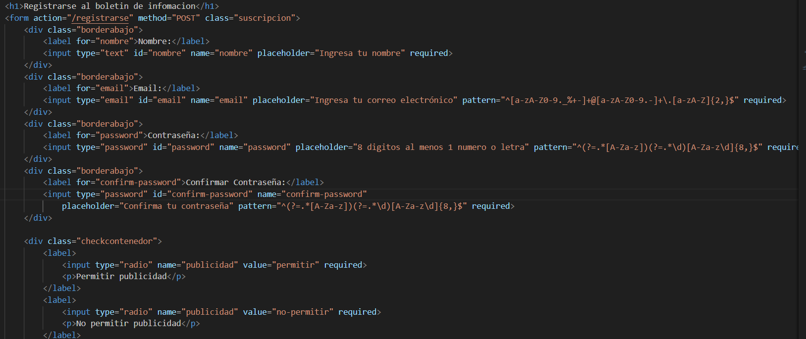

# Documentación

Html realizado por Carlos Lopez y Alejandro cayero
CSS realizado en su mayoria por Carlos Lopez y Rayane

Formularios realizados por Carlos Lopez

Formulario para añadir mensajes compuesto por un nombre, email y el campo del mensaje, el email tiene un a expresion regular que permite lo siguinte:
- permite letras y numernos
- Permite caracteres empeciales 
- Obliga a poner @
- Permite letras y numeros en el nombre del dominio
- Obliga a poner un . antes del dominio

Formulario para crear cuenta email igual que el anterior
Contraseña: Tiene que tener al menos 1 letra, 1 numero, longitud de 8 caracteres no se permiten caracteres especiales

Modificaciones realizadas en el html y css echas por Carlos Lopez, cambios realizados en el html y css de Contacto se ajustan los imputs y labels para que queden bien.